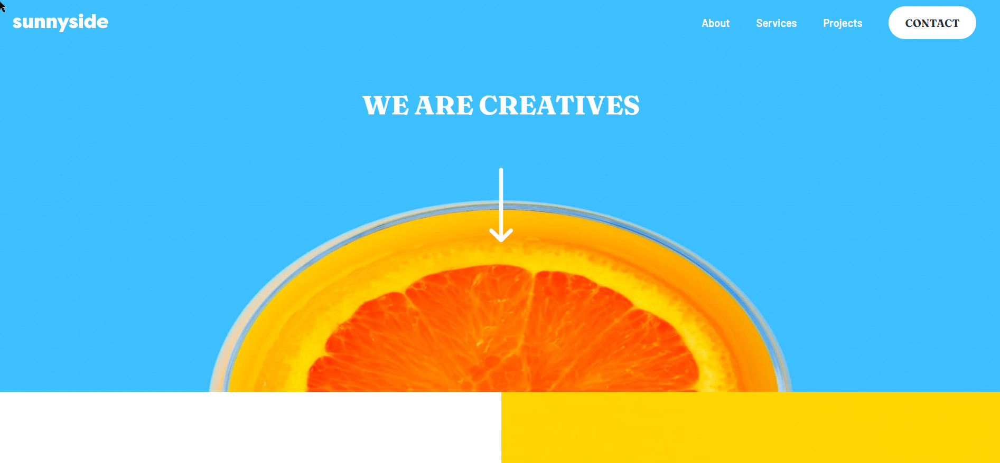

# Frontend Mentor - Sunnyside agency landing page solution

This is a solution to the [Sunnyside agency landing page challenge on Frontend Mentor](https://www.frontendmentor.io/challenges/sunnyside-agency-landing-page-7yVs3B6ef). Frontend Mentor challenges help you improve your coding skills by building realistic projects.

## Table of contents

-   [Overview](#overview)
    -   [The challenge](#the-challenge)
    -   [Screenshot](#screenshot)
    -   [Links](#links)
-   [My process](#my-process)
    -   [Built with](#built-with)
    -   [What I learned](#what-i-learned)
-   [Author](#author)

**Note: Delete this note and update the table of contents based on what sections you keep.**

## Overview

### The challenge

Users should be able to:

-   View the optimal layout for the site depending on their device's screen size
-   See hover states for all interactive elements on the page

### Screenshot

### Links

-   Solution URL: [Frontend Mentor Solution](https://www.frontendmentor.io/solutions/mobile-first-sunny-side-agency-website-2F6M3kLnm)
-   Live Site URL: [Netlify Live Site](https://crimson-sunny.netlify.app/)

## My process

### Built with

-   Semantic HTML5 markup
-   CSS custom properties
-   Flexbox
-   Mobile-first workflow

### What I learned

-   Gulp and browsersync
-   Sass

## Author

-   Website - [Vaideeswaran C](https://www.vaideeswaranc.com)
-   Frontend Mentor - [@vaideeswaran23](https://www.frontendmentor.io/profile/vaideeswaran23)
-   Twitter - [@vaideeswaran23](https://www.twitter.com/vaideeswaran23)
